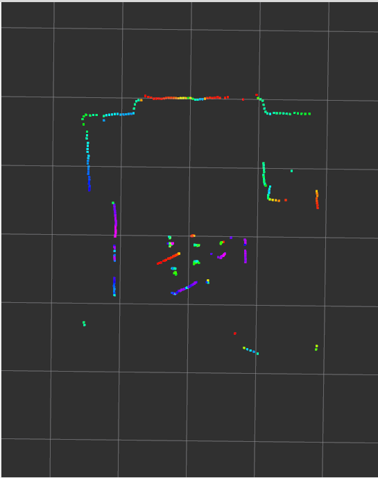

# ms200p

ROS 2 драйвер для 2D лидара Oradar MS200P. Считывает данные через последовательный порт, преобразовывает и публикует стандартные сообщения `sensor_msgs/LaserScan` в топик `/scan`.


### Пример визуализации RVIZ2


## Требования

- ROS 2 (проверено на Jazzy)
- `pyserial` (`python3-serial`)
- `sensor_msgs`, `geometry_msgs`, `tf2_ros`

## Установка

Склонируйте репозиторий в рабочее пространство ROS 2 и соберите пакет:

```bash
cd ~/ros2_ws/src
git clone <repo_url> ms200p
cd ..
colcon build --packages-select ms200p
source install/setup.bash
```

## Запуск

### Через launch-файл

```bash
ros2 launch ms200p ms200p.launch.py
```

### Напрямую

```bash
ros2 run ms200p ms200p_node --ros-args -p port:=/dev/ttyACM0
```

### RVIZ2
```bash
rviz2 -d ~/ros2_ws/src/ms200p/rviz/ms200p.rviz
```

## Протокол

Каждый пакет от датчика занимает 47 байт. Заголовок пакета — `0x54 0x2C`. В пакете содержится 12 точек скана, каждая из которых кодируется двумя байтами расстояния (в миллиметрах, little-endian) и одним байтом интенсивности, а также начальный угол, конечный угол, скорость вращения и контрольная сумма CRC-8. Драйвер проверяет контрольную сумму перед обработкой пакета и молча отбрасывает повреждённые кадры.

## Лицензия

MIT
